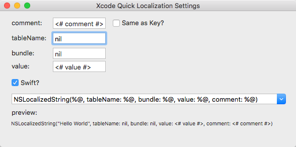

Xcode-Quick-Localization
========================

Xcode Plugin to Convert @"content" to NSLocalizedString(@"content", @"content")

Support Swift string, Convert "content" to NSLocalizedString("content", comment:"content")

How To Use
==========

Select any line in xcode, press option + shift + d. String will be converted to localized string. 

You can also access it under Edit -> Quick Localization

